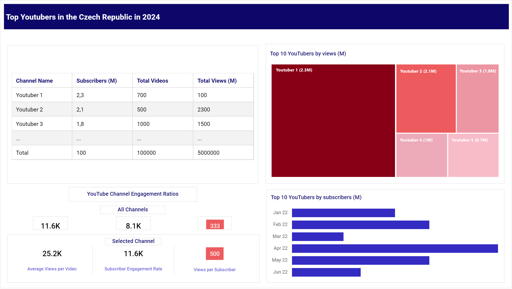

# Czech Top YouTubers 2024

## Intention
The marketing department wants to identify and analyze the top YouTubers in the Czech Republic for 2024 to determine which content creators would be the best fit for marketing campaigns next year. They want to focus on the YouTube channels of the top 100 YouTubers.

### Solution Idea
The goal is to create a dashboard that provides information to help the marketing team make informed decisions about which YouTubers are right to cooperate with or determine whether additional information is needed. The dashboard should include key metrics such as:
- Number of subscribers
- Total views per YouTuber
- Total uploaded videos per YouTuber
- Subscriber engagement rate
- etc.

## Data origin

**What data set is required to reach our goals?**  

The necessary data about the top YouTubers in the Czech Republic for 2024 includes the YouTuber names and the previously mentioned key metrics such as:

- Number of subscribers
- Number of views
- Number of uploaded videos
- etc.

Source of the data: 
1) <a href="https://starngage.com/plus/en-us/influencer/ranking/youtube/czech-republic" target="_blank">Ranking of the top Czech YouTubers</a>
2) YouTube API

## Project Steps

- Design
- Project building
- Testing
- Analysis and conclusion

### Dashboard Design

#### Required Dashboard Elements

**What should be included in the dashboard based on the specified requirements?**  

To outline the content, we first need to identify some key questions that the dashboard should answer:

- Who are the leading YouTubers by number of subscribers?
- Which channels have uploaded the most videos?
- Which channels have the most views?
- Which channels achieve the highest average views for each video?
- Which channels have the best views per subscriber ratio?
- Which channels display the strongest engagement rate per video?

These are some initial questions we aim to answer to reach our goal.

#### Tools requirements

**Tools required for the Process**

<table>
  <tr>
    <th style="text-align: center;">Tool</th>
    <th style="text-align: center;">Reason</th>
  </tr>
  <tr>
    <td style="text-align: center;">Jupyter Lab</td>
    <td style="text-align: center;">Data retrieval</td>
  </tr>
  <tr>
    <td style="text-align: center;">MS Excel</td>
    <td style="text-align: center;">Data exploration</td>
  </tr>
  <tr>
    <td style="text-align: center;">MS SQL Server</td>
    <td style="text-align: center;">Data cleaning, preparation, testing and analysis</td>
  </tr>
    <tr>
    <td style="text-align: center;">Power BI/Tableau</td>
    <td style="text-align: center;">Data visualization</td>
  </tr>
</table>

|        Tool        |                      Reason                        |
|--------------------|----------------------------------------------------|
| Jupyter Lab        | Data retrieval                                     |
| MS Excel           | Data exploration                                   |
| MS SQL Server      | Data cleaning,  preparation, testing and analyzing |
| Power BI/Tableau   | Data visualization                                 |

#### Dashboard Visualization

The data visuals that will be suitable for answering our questions include:  
Tables, Scorecards (Engagement metrics), Bar charts, and other visualizations such as Treemaps.

**Dasbhoard mockup:**

### Dashboard Design
