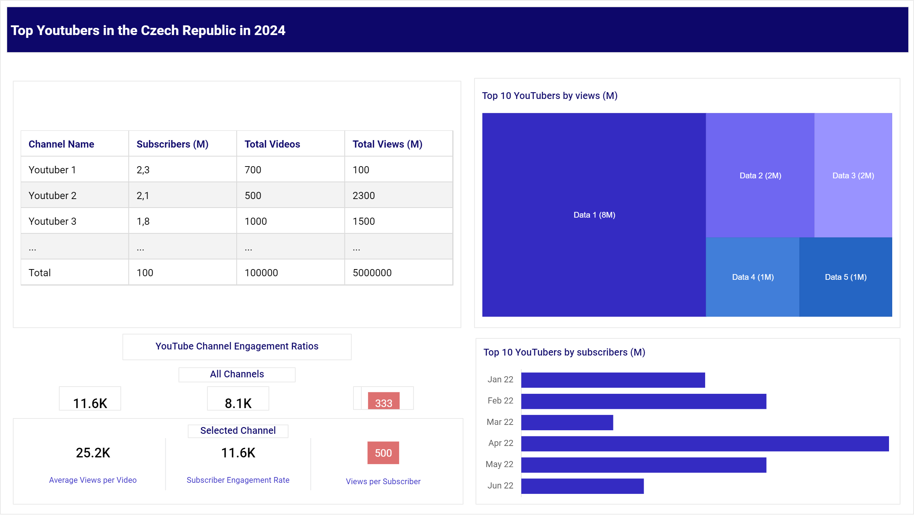
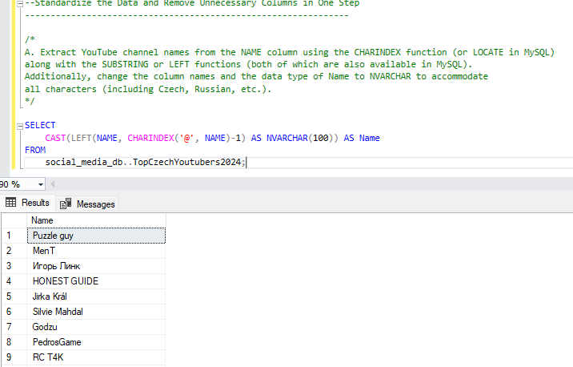
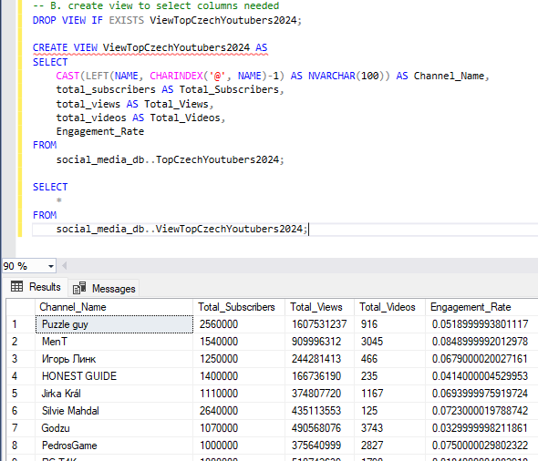
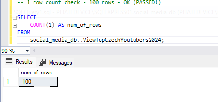
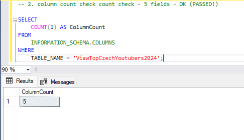
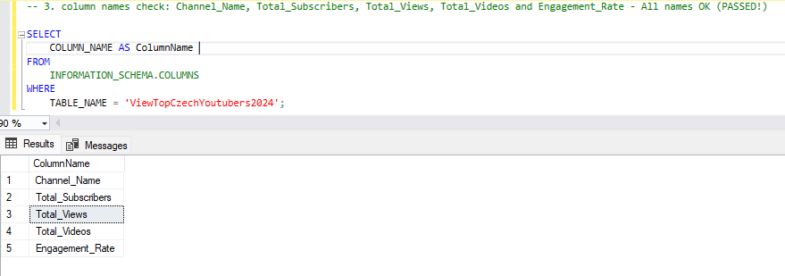
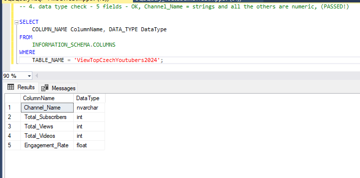
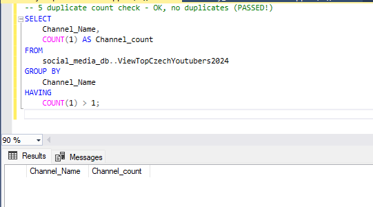

# CZECH TOP YOUTUBERS 2024

## Intention

### What is the goal?
The marketing department wants to identify and analyze the top YouTubers in the Czech Republic for 2024 to determine which content creators would be the best fit for marketing campaigns next year. They want to focus on the YouTube channels of the top 100 YouTubers and would like to know if it is sufficient to use public sources to obtain the data.

### Solution Idea
We need to identify the metrics and KPIs that we can use to compare the data..
The goal is to create a dashboard that provides information to help the marketing team make informed decisions about which YouTubers are the right fit for collaboration or to determine whether additional information is needed. The dashboard should include key metrics such as:
- Number of subscribers
- Total views per YouTuber
- Total uploaded videos per YouTuber
- Subscriber engagement rate
- etc.

## Data origin
We need to identify all the necessary data and determine the data sources required to reach our goal. It is also important to consider data storage, the size of the dataset we need, how often we need to refresh the data, and other relevant factors.

**What data set is required to reach our goals?**  

The necessary data about the top YouTubers in the Czech Republic for 2024 includes the YouTuber names and the previously mentioned key metrics such as:

- Number of subscribers
- Number of views
- Number of uploaded videos
- Engagement rate
- etc.

Source of the data: 
1) <a href="https://starngage.com/plus/en-us/influencer/ranking/youtube/czech-republic" target="_blank">Ranking of the top Czech YouTubers</a>  
2) <a href="https://developers.google.com/youtube/v3/getting-started" target="_blank">YouTube API</a>  
3) <a href="https://hypeauditor.com" target="_blank">Other statistics</a>

## Project Steps

- Design
- Project building
- Data cleaning and testing
- Visualization, Analysis and conclusion

### Dashboard Design

#### Required Dashboard Elements

**What should be included in the dashboard based on the specified requirements?**  

To outline the content, we first need to identify some key questions that the dashboard should answer:

- Who are the leading YouTubers by number of subscribers?
- Which channels have uploaded the most videos?
- Which channels have the most views?
- Which channels achieve the highest average views per video?
- Which channels have the best views to subscriber ratio?
- Which channels display the strongest subscriber engagement rate?

These are some initial questions we aim to answer to reach our goal.

#### Dashboard Visualization

The data visuals that will be suitable for answering our questions include:  
Tables, Scorecards (Engagement metrics), Bar charts, and other visualizations such as Treemaps.

**Dasbhoard mockup:**

#### Tools requirements

**Tools required for the Process**

<table>
  <tr>
    <th style="text-align: center;">Tool</th>
    <th style="text-align: center;">Reason</th>
  </tr>
  <tr>
    <td style="text-align: left;">Jupyter Lab</td>
    <td style="text-align: left;">Data retrieval</td>
  </tr>
  <tr>
    <td style="text-align: left;">MS Excel</td>
    <td style="text-align: left;">Data exploration</td>
  </tr>
  <tr>
    <td style="text-align: left;">MS SQL Server</td>
    <td style="text-align: left;">Data cleaning, preparation, testing and analysis</td>
  </tr>
    <tr>
    <td style="text-align: left;">Power BI/Tableau</td>
    <td style="text-align: left;">Data visualization</td>
  </tr>
</table>

### Project building

#### General Workflow

What’s the overall process to develop the solution?

- Data Acquisition: Retrieve the necessary data (see the section on Data Sources).
- Data Exploration: Analyze the data in Excel to understand its structure and general quality.
- Data Loading: Import the data into SQL Server for further processing.
- Data Cleaning: Use SQL queries to clean and standardize the data for later analysis.
- Data Testing: Verify the integrity and accuracy of the data using SQL Server.
- Data Visualization: Create visual representations of the data in Power BI or Tableau.
- Insights Formulation: Derive findings and conclusions based on the visualized data.
- Documentation: Prepare documentation (including commentary) to support the final conclusions.
- Sharing: Share the final visualizations, recommendations, and documentation with the marketing department
- Feedback: Gather feedback from the marketing department/client and make any necessary adjustments to the project (this usually involves revisiting previous steps and should be part of every previous step).

#### Data exploration

In the next phase, we gain an overview of what the data contains, identifying errors, inconsistencies, and any other issues (e.g., unknown characters, corrupted text, etc.).

- What are our findings from the initial exploration of the data? What has caught our attention? What initial shortcomings do we see, and are we satisfied with the quality and quantity of the data?

 - We are determining whether we have sufficient data: In our case, we focus on whether we have at least five essential columns that contain the data needed for this analysis (see the section on necessary data to achieve the goal). If this is not the case, we would need to contact the client (marketing department) for further information.

- The first column contains not only the channel name but also the channel ID. The data are separated by the @ symbol, which will help us extract the names.

- Some columns contain incorrect data formats or even missing data. It is necessary to confirm whether these columns are needed, and if so, we will address them further during the data preparation.

- We actually have more data than we currently need. Therefore, it is also necessary to focus on this and decide whether we will remove some of these columns and how we will do so.

### Data cleaning and testing

#### Data cleaning and preparation

The aim is to modify our dataset to ensure it is organized and ready for analysis.

##### The processed data should meet the following criteria and limitations:

Only relevant columns should be kept.
We should remove all duplicates in the relevant columns.
We need to standardize the data (rename column names, retrieve unambiguous identifiers such as IDs, channel names, etc.).
The data types in the columns must be suitable for the data in each column.
No column should contain null values.

##### What steps are needed to clean and modify the data into the required format?

- Remove Duplicates - There are no duplicates in this dataset.
- **Standardize the Data** - Extract YouTube channel names from the first column and rename columns using appropriate aliases.
- Remove null (or blank Values) - We do not need columns with NULL or blank values in this case.
- **Remove unnecessary Columns** - Eliminate irrelevant columns by selecting only the relevant ones (creating a special view).  

**1. Standardize data**  

**2. Create the SQL view**   

#### Data testing

- What quality data checks are necessary to create? 
- What data validation do we need to ensure the dataset?
  
We need to check following informations:  

Number of rows and columns:  

<table>
  <tr>
    <th style="text-align: center;">Property</th>
    <th style="text-align: center;">Number</th>
  </tr>
  <tr>
    <td style="text-align: center;">Number of Rows</td>
    <td style="text-align: center;">100</td>
  </tr>
  <tr>
    <td style="text-align: center;">Number of Columns</td>
    <td style="text-align: center;">5</td>
  </tr>
</table>  

Data types a column names:  

<table>
  <tr>
    <th style="text-align: center;">Column Name</th>
    <th style="text-align: center;">Data Type</th>
  </tr>
  <tr>
    <td style="text-align: center;">channel_name</td>
    <td style="text-align: center;">NVARCHAR</td>
  </tr>
  <tr>
    <td style="text-align: center;">total_subscribers</td>
    <td style="text-align: center;">INTEGER</td>
  </tr>
    <tr>
    <td style="text-align: center;">total_views</td>
    <td style="text-align: center;">NVARCHAR</td>
  </tr>
  <tr>
    <td style="text-align: center;">total_videos</td>
    <td style="text-align: center;">INTEGER</td>
  </tr>
  <tr>
    <td style="text-align: center;">engagement_rate</td>
    <td style="text-align: center;">FLOAT</td>
  </tr>
</table>  

The following data quality checks have been performed to ensure the dataset is accurate, consistent, and ready for analysis.

**Row count check**
- SQL Query with output:

**Column count check**
- SQL Query with output:

**Column name check**
- SQL Query with output:  
  

**Data type check** 
- SQL Query with output:

**Duplicate count check**  
- SQL Query with output:

  
### Visualization, Analysis and conclusion

#### Data visualization  

##### Final results  

- Dashboard visualization in Power BI:

<video width="640" height="360" controls>
    <source src="assets/images/DashboardVideo.mp4" type="video/mp4">
    Váš prohlížeč nepodporuje přehrávač videa.
</video>
