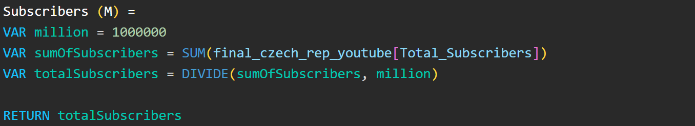

# CZECH TOP YOUTUBERS 2024

## Table of Contents

- [Intention](#intention)
  - [Goal](#goal)
  - [Solution Idea](#solution-idea)
- [Data origin](#data-origin)
- [Project Steps](#project-steps)
- [Dashboard Design](#dashboard-design)
  - [Required Dashboard Elements](#required-dashboard-elements)
  - [Dashboard Visualization](#dashboard-visualization)
  - [Tools requirements](#tools-requirements)
- [Project building](#project-building)
  - [General Workflow](#general-workflow)
  - [Data exploration](#data-exploration)
- [Data cleaning and testing](#data-cleaning-and-testing)
  - [Data cleaning and preparation](#data-cleaning-and-preparation)
  - [Data testing](#data-testing)
- [Visualization](#visualization)
  - [Data Visualization](#data-visualization)
  - [Measures](#measures)
- [Analysis](#analysis)
  - [Results overview](#results-overview)
  - [Validation - Scenarios ](#validation---scenarios )
- [Conclusion](#conclusion)
  - [Findings](#findings)
  - [Recommendations](#recommendations)

## Intention

### Goal
The marketing department wants to identify and analyze the top YouTubers in the Czech Republic for 2024 to determine which content creators would be the best fit for marketing campaigns next year. They want to focus on the YouTube channels of the top 100 YouTubers and would like to know if it is sufficient to use public sources to obtain the data.

### Solution Idea
We need to identify the metrics and KPIs that we can use to compare the data.
The goal is to create a dashboard that provides information to help the marketing team make informed decisions about which YouTubers are the right fit for collaboration or to determine whether additional information is needed. The dashboard should include key metrics such as:
- Number of subscribers
- Total views per YouTuber
- Total uploaded videos per YouTuber
- Subscriber engagement rate
- etc.

## Data origin
We need to identify all the necessary data and determine the data sources required to reach our goal. It is also important to consider data storage, the size of the dataset we need, how often we need to refresh the data, and other relevant factors.

**What data set is required to reach our goals?**  

The necessary data about the top YouTubers in the Czech Republic for 2024 includes the YouTuber names and the previously mentioned key metrics such as:

- Number of subscribers
- Number of views
- Number of uploaded videos
- Engagement rate
- etc.

Source of the data:  
1) <a href="https://starngage.com/plus/en-us/influencer/ranking/youtube/czech-republic" target="_blank">Ranking of the top Czech YouTubers</a>  
2) <a href="https://developers.google.com/youtube/v3/getting-started" target="_blank">YouTube API</a>  
3) <a href="https://hypeauditor.com" target="_blank">Other statistics</a>  

## Project Steps

- Design  
- Project building  
- Data cleaning and testing  
- Visualization  
- Analysis  
- Conclusion  

## Dashboard Design

### Required Dashboard Elements

**What should be included in the dashboard based on the specified requirements?**  

To outline the content, we first need to identify some key questions that the dashboard should answer:

|      Number      |                                    Question                                   |
|:----------------:|:------------------------------------------------------------------------------|
|         1        | Who are the leading YouTubers by number of subscribers?                       |
|         2        | Which channels have uploaded the most videos?                                 |
|         3        | Which channels have the most views?                                           |
|         4        | Which channels achieve the highest average views per video?                   |
|         5        | Which channels have the best views to subscriber ratio?                       |
|         6        | Which channels display the strongest subscriber engagement rate*?             |  

**Subscriber engagement rate - the percentage of viewers who interact with the influencer's content*  

These are some initial questions we aim to answer to reach our goal.

### Dashboard Visualization

The data visuals that will be suitable for answering our questions include:  
Tables, Scorecards (Engagement metrics), Bar charts, and other visualizations such as Treemaps.

**Dashboard mockup:**

### Tools requirements

**Tools required for the Process**

<table>
  <tr>
    <th style="text-align: center;">Tool</th>
    <th style="text-align: center;">Reason</th>
  </tr>
  <tr>
    <td style="text-align: left;">Jupyter Lab</td>
    <td style="text-align: left;">Data retrieval</td>
  </tr>
  <tr>
    <td style="text-align: left;">MS Excel</td>
    <td style="text-align: left;">Data exploration</td>
  </tr>
  <tr>
    <td style="text-align: left;">MS SQL Server</td>
    <td style="text-align: left;">Data cleaning, preparation, testing and analysis</td>
  </tr>
    <tr>
    <td style="text-align: left;">Power BI/Tableau</td>
    <td style="text-align: left;">Data visualization</td>
  </tr>
</table>

## Project building

### General Workflow

What’s the overall process to develop the solution?

- Data Acquisition: Retrieve the necessary data (see the section on Data Sources).
- Data Exploration: Analyze the data in Excel to understand its structure and general quality.
- Data Loading: Import the data into SQL Server for further processing.
- Data Cleaning: Use SQL queries to clean and standardize the data for later analysis.
- Data Testing: Verify the integrity and accuracy of the data using SQL Server.
- Data Visualization: Create visual representations of the data in Power BI or Tableau.
- Insights Formulation: Derive findings and conclusions based on the visualized data.
- Documentation: Prepare documentation (including commentary) to support the final conclusions.
- Sharing: Share the final visualizations, recommendations, and documentation with the marketing department
- Feedback: Gather feedback from the marketing department/client and make any necessary adjustments to the project (this usually involves revisiting previous steps and should be part of every previous step).

### Data exploration

In the next phase, we gain an overview of what the data contains, identifying errors, inconsistencies, and any other issues (e.g., unknown characters, corrupted text, etc.).

- What are our findings from the initial exploration of the data? What has caught our attention? What initial shortcomings do we see, and are we satisfied with the quality and quantity of the data?

 - We are determining whether we have sufficient data: In our case, we focus on whether we have at least five essential columns that contain the data needed for this analysis (see the section on necessary data to achieve the goal). If this is not the case, we would need to contact the client (marketing department) for further information.

- The first column contains not only the channel name but also the channel ID. The data are separated by the @ symbol, which will help us extract the names.

- Some columns contain incorrect data formats or even missing data. It is necessary to confirm whether these columns are needed, and if so, we will address them further during the data preparation.

- We actually have more data than we currently need. Therefore, it is also necessary to focus on this and decide whether we will remove some of these columns and how we will do so.

## Data cleaning and testing

### Data cleaning and preparation

The aim is to modify our dataset to ensure it is organized and ready for analysis.

##### The processed data should meet the following criteria and limitations:

Only relevant columns should be kept.
We should remove all duplicates in the relevant columns.
We need to standardize the data (rename column names, retrieve unambiguous identifiers such as IDs, channel names, etc.).
The data types in the columns must be suitable for the data in each column.
No column should contain null values.

#### What steps are needed to clean and modify the data into the required format?

- Remove Duplicates - There are no duplicates in this dataset.
- **Standardize the Data** - Extract YouTube channel names from the first column and rename columns using appropriate aliases.
- Remove null (or blank Values) - We do not need columns with NULL or blank values in this case.
- **Remove unnecessary Columns** - Eliminate irrelevant columns by selecting only the relevant ones (creating a special view).  

**1) Standardize data**  

**2) Create the SQL view**   

### Data testing

- What quality data checks are necessary to create? 
- What data validation do we need to ensure the dataset?
  
We need to check following informations:  

-	Number of rows and columns
-	
<table>
  <tr>
    <th style="text-align: center;">Property</th>
    <th style="text-align: center;">Number</th>
  </tr>
  <tr>
    <td style="text-align: center;">Number of Rows</td>
    <td style="text-align: center;">100</td>
  </tr>
  <tr>
    <td style="text-align: center;">Number of Columns</td>
    <td style="text-align: center;">5</td>
  </tr>
</table>  

- The data types and column names 

<table>
  <tr>
    <th style="text-align: center;">Column Name</th>
    <th style="text-align: center;">Data Type</th>
  </tr>
  <tr>
    <td style="text-align: center;">channel_name</td>
    <td style="text-align: center;">NVARCHAR</td>
  </tr>
  <tr>
    <td style="text-align: center;">total_subscribers</td>
    <td style="text-align: center;">INTEGER</td>
  </tr>
    <tr>
    <td style="text-align: center;">total_views</td>
    <td style="text-align: center;">NVARCHAR</td>
  </tr>
  <tr>
    <td style="text-align: center;">total_videos</td>
    <td style="text-align: center;">INTEGER</td>
  </tr>
  <tr>
    <td style="text-align: center;">engagement_rate</td>
    <td style="text-align: center;">FLOAT</td>
  </tr>
</table>  

The following data quality checks have been performed to ensure the dataset is accurate, consistent, and ready for analysis.

**Row count check**
- SQL Query with output:

**Column count check**
- SQL Query with output:

**Column name check**
- SQL Query with output:  
  

**Data type check** 
- SQL Query with output:

**Duplicate count check**  
- SQL Query with output:

  
## Visualization

### Data Visualization 

- Dashboard visualization in Power BI shows Top Czech Youtubers in 2024:

**Image**
  
  
**Gif**
  

### Measures

#### DAX Measures in Power BI

1) Total Subscribers (M)  

  

2) Total Videos  

  

3) Total Views (M)  

  

4) Average Views Per Video (M)  

  

5) Engagement Rate  

  

6) Views Per Subscriber  

  

#### Tableau Measures  

1) Average Views Per Video  

  

2) Engagement Rate  

  

3) Views Per Subscriber  

  

## Analysis

### Results overview

For this analysis, we're going to focus on the questions that should provide answers to the marketing department.

Here are the main topics we need to answer:

- What are the 10 YouTubers (YouTube channels) with the largest subscriber base?
- Which 10 YouTubers (YouTube channels) have posted the most content?
- Who are the 10 YouTubers (YouTube channels) with the highest total view count?
- What are the 10 YouTubers (YouTube channels) that get the highest average views per video?
- Which 10 YouTubers (YouTube channels) have the best views-to-subscriber ratio?
- Who are the 10 YouTubers (YouTube channels) with the highest subscriber engagement rate per video?

**1) What are the 10 YouTubers (YouTube channels) with the largest subscriber base?**  

| Rank | Channel Name                  | Subscribers (M) |
|------|-------------------------------|-----------------|
| 1    | Silvie Mahdal                 |       2.64      |
| 2    | Puzzle guy                    |       2.56      |
| 3    | MenT                          |       1.54      | 
| 4    | HONEST GUIDE                  |       1.40      |
| 5    | Adam Something                |       1.28      |
| 6    | Alexander Zakshevsky          |       1.25      |
| 7    | Игорь Линк                    |       1.25      |
| 8    | DIY crafts from A4 PAPER      |       1.22      |
| 9    | FIZIstyle                     |       1.16      |
| 10   | Mr. Michal                    |       1.12      |  

**2) Which 10 YouTubers (YouTube channels) have posted the most content?** 

| Rank | Channel Name                      | Total Videos |
|------|-----------------------------------|:------------:|
| 1    | Radio Free Europe/Radio Liberty   |     9,649    |
| 2    | Totalfilm.cz                      |     7,812    |
| 3    | Алексей Ворон                     |     5,001    |
| 4    | Godzu                             |     3,743    |
| 5    | Agraelus                          |     3,315    |
| 6    | Sterakdary                        |     3,085    |
| 7    | MenT                              |     3,045    |
| 8    | Alkanhraje                        |     2,952    |
| 9    | PedrosGame                        |     2,827    |
| 10   | Alexander Zakshevsky              |     2,780    |  

**3) Who are the 10 YouTubers (YouTube channels) with the highest total view count?**  

| Rank | Channel Name                          |  Total Views(M) |
|:---- |:--------------------------------------|:-----------------:|
| 1    | Puzzle guy                            |      1,607.53     |
| 2    | MenT                                  |        910.00     |
| 3    | Baxtrix                               |        776.72     |
| 4    | FIZIstyle                             |        733.69     |
| 5    | Milion Plus                           |        675.20     |
| 6    | SirYakari                             |        620.42     |
| 7    | Štístko a Poupěnka                    |        602.02     |
| 8    | ViralBrothers SHOW                    |        552.84     |
| 9    | Blakkwood Records                     |        540.98     |
| 10   | Radio Free Europe/Radio Liberty       |        535.21     |  

**4) What are the 10 YouTubers (YouTube channels) that get the highest average views per video?**  

| Rank | Channel Name               |  Avg Views Per Video (M) |
|:---- |:---------------------------|:------------------------:|
| 1    | ViralBrothers SHOW         |           6.66           |
| 2    | Mr. Michal                 |           4.56           |
| 3    | atomic marvel              |           4.19           |
| 4    | Prague Cello Quartet       |           3.92           |
| 5    | BESPREDEL                  |           3.81           |
| 6    | Štístko a Poupěnka         |           3.76           |
| 7    | Pat a Mat                  |           3.48           |
| 8    | Silvie Mahdal              |           3.48           |
| 9    | Slza                       |           3.35           |
| 10   | Ben Cristovao              |           2.26           |  

**5) Which 10 YouTubers (YouTube channels) have the best views-to-subscriber ratio?**

| Rank | Channel Name               | Views Per Subscriber |
|:---- |:---------------------------|:--------------------:|
| 1    | Štístko a Poupěnka         |         1568         |
| 2    | Totalfilm.cz               |         1146         |
| 3    | tynikdy                    |         1143         |
| 4    | Milion Plus                |         1089         |
| 5    | Blakkwood Records          |         1065         |
| 6    | Tvoje tvář má známý hlas   |         994          |
| 7    | Baxtrix                    |         873          |
| 8    | Pokáčovo Kanál             |         758          |
| 9    | TOP veci do 2 minut        |         734          |
| 10   | Alkanhraje                 |         729          |  

**6) Who are the 10 YouTubers (YouTube channels) with the highest subscriber engagement rate per video?**

| Rank | Channel Name             |  Engagement Rate  |
|:---- |:-------------------------|:-----------------:|
| 1    | Suara Injil              |       14.87%      |
| 2    | Alexander Zakshevsky     |       13.01%      |
| 3    | Алексей Ворон            |       12.85%      |
| 4    | SmusaGames               |        9.91%      |
| 5    | Wedry                    |        9.28%      |
| 6    | PIERRE XO                |        9.07%      |
| 7    | Jmenuju Se Martin        |        8.52%      |
| 8    | MenT                     |        8.49%      |
| 9    | NejFake                  |        8.37%      |
| 10   | Stay12                   |        8.33%      |  

In this analysis, we will primarily prioritize the key metrics essential for achieving the expected Return on Investment (ROI) for our marketing department, specifically focusing on YouTube channels with the highest number of subscribers, total videos uploaded, and total view count. By analyzing these metrics, we aim to identify the most suitable YouTubers to optimize our marketing department efforts on the platform.  

### Validation - Scenarios  

These metrics (YouTube channels with the highest number of subscribers, total videos uploaded, and total views) will be used in three simulation scenarios through which we will attempt to find suitable YouTubers. These scenarios will help us evaluate different approaches and campaign costs, allowing us to visualize the varying profitability of individual campaigns.

#### 1) Scenario: Collaboration (based on product placement) with YouTubers (YouTube Channels) with the Most Subscribers 

The idea of this scenario is to consider the profitability of **product placements** in videos by collaborating with YouTubers who have the highest number of subscribers. We will identify the 3 most suitable YouTubers (YouTube channels).  

*Campaign Variables in 1. Scenario*  

| Item                               | Value                |
|------------------------------------|----------------------|
| Product cost                       | 200 CZK              |
| Conversion rate                    | 2 %                  |
| Campaign cost (one-time fee/period)| 500,000.00 CZK       |  

*3 Most Suitable YouTubers (YouTube channels) in 1. Scenario*  

| Rank    | CHANNEL NAME       | MAIN TOPIC              |
|---------|--------------------|-------------------------|
| **1**   | **Mr. Michal**     | **Entertainment**       |
| 2       | Silvie Mahdal      | Drawing tutorials       |
| 3       | Puzzle Guy         | Puzzle content          |  
  
  
**1) Mr. Michal**
   
   - Average views per video = 4.56 million
   - Product cost = 200 CZK
   - Potential product sales per video =  4.56 million * 2 % (conversion rate) = 91,200.00 (units)
   - Potential revenue per video = 91,200.00 (units) * 200 (CZK) = 18,240,000.00 CZK
   - Campaign cost (one-time fee/period) =  500,000.00 CZK
   - Potential net profit =  18,240,000.00 (CZK) - 500,000.00 (CZK) = 17,740,000.00 CZK  

**2) Silvie Mahdal**
   
   - Average views per video = 3.48 million
   - Product cost = 200 CZK
   - Potential product sales per video = 3.48 million * 2 % (conversion rate) = 69,600.00 (units)
   - Potential revenue per video = 69,600.00 (units) * 200 (CZK) = 13,920,000.00 CZK
   - Campaign cost (one-time fee/period) = 500,000.00 CZK
   - Potential net profit =  13,920,000.00 (CZK) - 500,000.00 (CZK) = 13,420,000.00 CZK  

**3) Puzzle guy**
   
   - Average views per video = 1.75 million
   - Product cost = 200 CZK
   - Potential product sales per video = 1.75 million * 2 % (conversion rate) = 35,000.00 (units)
   - Potential revenue per video = 35,000.00 (units) * 200 (CZK) = 7,000,000.00 CZK
   - Campaign cost (one-time fee/period) = 500,000.00 CZK
   - Potential net profit =  7,000,000.00 (CZK) - 500,000.00 (CZK) = 6,500,000.00 CZK  

   Best alternative in this scenario is **Mr. Michal** with **17,740,000.00 CZK** potential net profit.  

**SQL Query - Variables Initialization for 1st Scenario**  

**SQL Query - Code and Output for 1st Scenario**

#### 2) Scenario: Collaboration (based on video series) with YouTubers (YouTube channels) Who Have Uploaded the Most Videos  
  
The goal of this scenario is to evaluate the profitability of video series through sponsorships with YouTubers who have the highest number of uploaded videos. We will select the three most suitable YouTubers (YouTube channels).

*Campaign Variables in 2. Scenario* 

| Item                        | Value                |
|-----------------------------|----------------------|
| Product cost                | 200 CZK              |
| Conversion rate             | 2 %                  |
| Campaign cost per video     | 50,000.00 CZK        |  
| Number of videos            | 12                   |
| Total campaign cost         | 600,000.00 CZK       |  
  
*3 Most Suitable YouTubers (YouTube channels) in 2. Scenario*  

| Rank    | CHANNEL NAME           | MAIN TOPIC           |
|---------|------------------------|----------------------|
| **1**   | **MenT**               | **Gaming content**   |
| 2       | Alexander Zakshevsky   | Music                |
| 3       | Godzu                  | Gaming content       |
| 3       | PedrosGame             | Gaming content       |  
  
**1) MenT**
   
   - Average views per video = 300,000
   - Product cost = 200 CZK
   - Potential product sales per video =  300,000 * 2 % (conversion rate) = 6,000.00 (units)  
   - Potential revenue per video = 6,000.00 (units) * 200 (CZK) = 1,200,000.00 CZK  
   - Campaign cost per video = 50,000.00 CZK
   - Number of videos = 12
   - Total campaign cost = 50,000.00 (CZK) * 12 (videos) = 600,000 CZK
   - Potential net profit = 1,200,000.00 (CZK) - 600,000 (CZK) = 600,000.00 CZK  

**2) Alexander Zakshevsky**
   
   - Average views per video = 140,000
   - Product cost = 200 CZK
   - Potential product sales per video = 140,000 * 2 % (conversion rate) = 2,800.00 (units)
   - Potential revenue per video = 2,800.00 (units) * 200 (CZK) = 560,000.00 CZK
   - Campaign cost per video = 50,000.00 CZK
   - Number of videos = 12
   - Total campaign cost = 50,000.00 (CZK) * 12 (videos) = 600,000 CZK
   - Potential net profit = 560,000.00 (CZK) - 600,000 (CZK) = -40,000.00 CZK **(potential loss)** 

**3) Godzu**
   
   - Average views per video = 130,000
   - Product cost = 200 CZK
   - Potential product sales per video = 130,000 * 2 % (conversion rate) = 2,600.00 (units)
   - Potential revenue per video = 2,600.00 (units) * 200 (CZK) = 520,000.00 CZK
   - Campaign cost per video = 50,000.00 CZK
   - Number of videos = 12
   - Total campaign cost = 50,000.00 (CZK) * 12 (videos) = 600,000 CZK
   - Potential net profit =  520,000.00 (CZK) - 600,000 (CZK) = -80,000.000 (CZK) **(potential loss)** 

**3) PedrosGame**
   
   - Average views per video = 130,000
   - Product cost = 200 CZK
   - Potential product sales per video = 130,000 * 2 % (conversion rate) = 2,600.00 (units)
   - Potential revenue per video = 2,600.00 (units) * 200 (CZK) = 520,000.00 CZK
   - Campaign cost per video = 50,000.00 CZK
   - Number of videos = 12
   - Total campaign cost = 50,000.00 (CZK) * 12 (videos) = 600,000 CZK
   - Potential net profit =  520,000.00 (CZK) - 600,000 (CZK) = -80,000.000 (CZK) **(potential loss)** 

   The best and only alternative in this scenario, if we want to achieve a profit, is **MenT** with **600,000.00 CZK** potential net profit.  

**SQL Query - Variables Initialization for 2nd Scenario**  

**SQL Query - Code and Output for 2nd Scenario**

  
#### 3) Scenario: Collaboration with YouTubers (YouTube Channels) with the most views  

In this scenario, we aim to analyze YouTubers with the highest view counts. Our focus will be on evaluating the profitability of influencer marketing (with a 2.5 to 3-month contract) through collaborations with these YouTubers. To achieve this, we will select the three most suitable YouTubers (YouTube channels) for our campaign.

*Campaign Variables in 3. Scenario* 

| Item                                | Value                 |
|-------------------------------------|-----------------------|
| Product cost                        | 200 CZK               |
| Conversion rate                     | 2 %                   |
| Total campaign cost  (2.5-3 months) | 960,000.00 CZK        |  
  
*3 Most Suitable YouTubers (YouTube channels) in 3. Scenario*  

| Rank | CHANNEL NAME              | MAIN TOPIC               |
|------|---------------------------|--------------------------|
| 1    | ViralBrothers SHOW        | Entertainment            |
| 2    | Štístko a Poupěnka        | Children's entertainment |
| 3    | Puzzle Guy                | Puzzle solving           |  

**1) ViralBrothers SHOW**
   
   - Average views per video = 6.66 million
   - Product cost = 200 CZK
   - Potential product sales per video =  6.66 million * 2 % (conversion rate) = 133,200.00 (units)
   - Potential revenue per video = 133,200.00 (units) * 200 (CZK) = 26,640,000.00 CZK
   - Campaign cost (Contract duration: 2.5 to 3 months based on fee variability) =  960,000.00 CZK
   - Potential net profit =  26,640,000.00 (CZK) - 960,000.00 (CZK) = 25,680,000.00 CZK  

**2) Štístko a Poupěnka**
   
   - Average views per video = 3.76 million
   - Product cost = 200 CZK
   - Potential product sales per video = 3.76 million * 2 % (conversion rate) = 75,200.00 (units)
   - Potential revenue per video = 75,200.00 (units) * 200 (CZK) = 15,040,000.00 CZK
   - Campaign cost (Contract duration: 2.5 to 3 months based on fee variability) = 960,000.00 CZK
   - Potential net profit =  15,040,000.00 (CZK) - 960,000.00 (CZK) = 14,080,000.00 CZK  

**3) Puzzle guy**
   
   - Average views per video = 1.75 million
   - Product cost = 200 CZK
   - Potential product sales per video = 1.75 million * 2 % (conversion rate) = 35,000.00 (units)
   - Potential revenue per video = 35,000.00 (units) * 200 (CZK) = 7,000,000.00 CZK
   - Campaign cost (Contract duration: 2.5 to 3 months based on fee variability) = 960,000.00 CZK
   - Potential net profit =  7,000,000.00 (CZK) - 960,000.00 (CZK) = 6,040,000.00 CZK

     Best alternative in this scenario is **ViralBrothers SHOW** with **25,680,000.00 CZK** potential net profit.  

**SQL Query - Variables Initialization for 3rd Scenario**  

  

**SQL Query - Code and Output for 3rd Scenario**  

  

## Conclusion

In this section, we will summarize the main information from our analysis and, based on these insights, provide recommendations for the marketing department.

### Findings

1) Regarding the YouTubers (YouTube channels) with the most subscribers, we found out:
   
  - Silvie Mahdal, Puzzle Guy and  MenT are the once with the highest number of subscribers in the Czech Republic in 2024.
  - All 10 YouTubers (YouTube channels) with the most subscribers have over 1 million subscribers.
  - In the 1st scenario (collaboration based on product placement), the most suitable YouTuber is Mr. Michal, with a
    potential net profit of over 17.7 million CZK, followed by Silvie Mahdal with a potential net profit of over 13.4           million CZK, and Puzzle Guy in 3rd place with a potential net profit of 6.5 million CZK.

2) Focusing on the YouTubers (YouTube channels) with the most uploaded videos, we learned:
   
  - The YouTubers (YouTube channels) that posted the most content (including Radio Free Europe/Radio Liberty with               9,649 videos uploaded) did not suceed in the 2nd Scenario.
  - The only YouTuber (YouTube channel) able to generate profit in the 2nd Scenario is MenT, with a potential net profit         600,000.00 CZK. All others show a potential loss.
  - This Scenario appears to be less productive and much riskier compared to the others.

3) By concentrating on the YouTubers (YouTube channels) with the most views, we discovered:
   
  - Puzzle Guy is the YouTuber with the highest total view count. With over 1.6 billion views, he is by far the leader in       this category. The second, MenT, has 697 million fewer views, with a total of only 910 million. The remaining YouTubers     (YouTube channels) have between 535 million and 777 million views.
  - In the 3rd scenario (Collaboration with YouTubers with the most views based on contract), the most suitable YouTuber is     ViralBrothers SHOW, with a potential net profit of over 25.6 million CZK, followed by Štístko a Poupěnka with a             potential net profit of over 14 million CZK, and Puzzle Guy with a potential net profit of over 6 million CZK (this         YouTuber also succeeded in the 1st scenario).

Across all categories, YouTubers (YouTube channels) focusing on entertainment, gaming content, or music, tend to dominate, likely due to their consistent posting on the platform.

### Recommendations  

#### Resume

1) **The best YouTuber (YouTube channel) we recommend collaborating with based on product placement (the first scenario) is Mr. Michal**, as he is the optimal choice for enhancing visibility on YouTube and achieving the highest potential net profit (over 17.7 million CZK). While he may not have the largest subscriber base, his high views per video make him a valuable partner for our marketing campaign.

2) As mentioned in the Findings section, the second scenario appears to be dramatically less productive, resulting in a significantly lower return on investment. There is only one YouTuber worth considering in this case: MenT (gaming content), who can generate potential net profit, unlike other YouTubers in this category who are regular publishers. If our company were to focus on gaming content, there are likely better alternatives, such as SirYakari (even though he was not part of this scenario, in the third scenario, he performed significantly better than MenT). Despite posting less frequently, SirYakari averages 1 million views per video and generates over 3.1 million CZK in net profit, positioning him as a leader among YouTubers in the gaming content genre. In the case of focusing specifically on gaming content, it is worth mentioning the need for a deeper analysis, which would consider factors such as engagement rate, the specific content of gaming videos, and the overall activity of YouTubers in the past year. **Given all the factors mentioned, we do not recommend anyone in this scenario.**

3) **ViralBrothers SHOW is the best YouTuber (YouTube channel) to collaborate with based on contract if we are interested in maximizing our reach (the third scenario)**, as it offers significantly higher average views per video, leading to the highest potential net profit (25,680,000.00 CZK). However, if we focus on small children's products, it would be worth considering the channel Štístko a Poupěnka because of its specific genre, even though its subscriber base is dramatically lower.

4) **The top YouTubers to collaborate with based on our findings are ViralBrothers SHOW and Mr. Michal.** They are the best options due to their main genre of entertainment, which is broader compared to the other selected YouTubers. Both also have a fairly large subscriber base, and combined with their high profit potential, they are good candidates for long-term cooperation.
If we are looking for a specific genre to focus on, such as drawing or even puzzle-solving, then Silvie Mahdal (potentially Puzzle Guy) could also be a good option. Their subscriber base and engagement rate are the highest, but their content is aimed at a narrow audience.

#### Potential profit  

1) Signing a contract with the YouTube channel ViralBrothers SHOW could result in a net profit of 25,680,000 CZK.  
2) Collaboration with YouTuber Mr. Michal would bring us net profit of 17,740,000.00 CZK.  
3) From an influencer marketing contract with the YouTube channel Štístko a Poupěnka, we could expect a profit of 14,080,000 CZK.  
4) A partnership based on product placement with YouTuber Silvie Mahdal could generate a profit of 13,420,000 CZK.  
5) A product placement campaign with YouTuber Puzzle Guy could generate a profit of 6,500,000 CZK, while a contract-based collaboration would bring in 6,040,000 CZK.  
   
#### Course of Action

Based on this analysis (relying on the publicly available information), the best Youtube channel to cooperate on promotion of our product in long term partnership is ViralBrothers SHOW. 

We will discuss the possibilities with our marketing department to confirm the expectations for the collaborations. It is important to validate whether all requirements have been met. For example, we may find that expectations have changed, such as targeting a more specific audience or that profit is no longer a priority. Based on this, we may reconsider our recommendations (or dig deeper into the analysis to monitor trends and patterns over a longer period) or move forward with potential collaborations with ViralBrothers SHOW or Mr. Michal in the future.

What actions should we take afterward to implement the suggested decisions?

- Reach out to the teams associated with the ViralBrothers SHOW and/or Mr. Michal channels.
- Negotiate contracts that remain within the budget set for each marketing campaign.
- Launch the campaigns and monitor their performance against our established KPIs.
- Assess the results of the campaigns, gather insights, and optimize based on feedback from converted customers and the audiences of each channel.

#### Concluding Thoughts

**What sort of actions should we undertake before we really decide (and start to implement the marketing strategy) and why do we believe they are important?**

Should we focus on a deeper analysis?
Considering all the information we have, it is clearly insufficient for such a complex task, and we should conduct at least a further in-depth analysis of both mentioned channels. Specifically, we would be interested in:

- **Engagement rate:** This measures how many followers not only watch the videos but also engage through comments, likes, and shares. This will help us determine how engaged the audiences of these channels are. From the information available to us, we know that ViralBrothers SHOW has an engagement rate of 2.13%, while Mr. Michal has 3.32%. However, I did not use these figures for deeper analysis because they come from a different source than the other data. Although it has been verified that these data should be from the same period, we cannot state that with certainty; therefore, this figure was used more as a supplementary reference and for visualization in the dashboard.

- **Audience demographics**: Specifically, whether the channel’s focus aligns with the demographics of our average client (age, gender, interests).

- **Channel reach demographics:** Essentially, in which country or countries the YouTuber has the most impact on their followers.

- **Channel focus:** Whether the channel’s focus aligns with the product.

- **Reputation and credibility:** This refers to the YouTuber's reputation and whether they appear trustworthy and authentic.

- **Trends in follower growth:** This would provide us insights into the channel’s performance over time.

- **Frequency of video posting and overall annual activity on the channel:** This metric indicates the YouTuber's consistency in posting; a regular upload schedule helps maintain audience engagement and attract new subscribers. Additionally, understanding annual activity provides insight into how the YouTuber adapts to trends and keeps content fresh and relevant.

Conducting all of these actions is recommended after this analysis to ensure we are truly confident in our choice of YouTuber for our product. However, this would require access to non-public information or, alternatively, gathering publicly available information through further research, as this data is not typically summarized anywhere outside of paid databases. Therefore, everything mentioned above also answers the question of whether commonly available information is sufficient to fulfill the task assigned to us by the marketing department, and we do not consider it sufficient. That is why we recommend the actions mentioned above.
